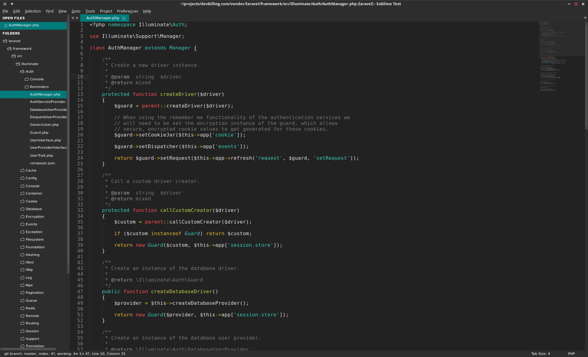
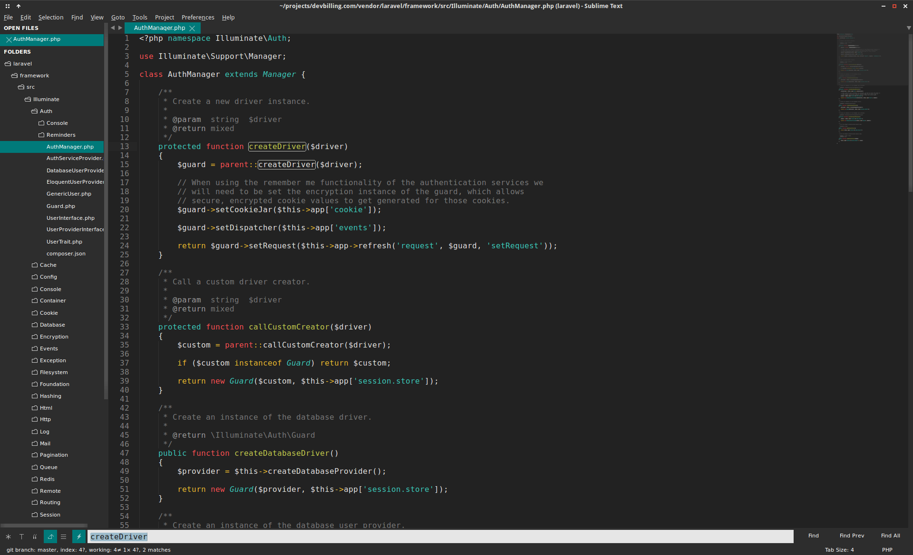
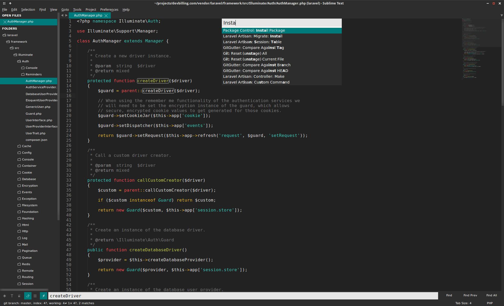

# Theme - Juicy

## Screenshots

## Installation

### Using Sublime Package Control

If you are using sublime package control, you can install directly from the `Package Control: Install Package` menu item.

The theme is listed as `Theme - Juicy` in the packages list.

##### Enabling the theme

To enable the theme and adjust theme settings edit your `Preferences.sublime-settings` file:

    "theme": "Juicy.sublime-theme"

##### Additional Settings:

    // small tabs
    "numix_small_tabs": true
    "numix_xsmall_tabs": true

    // Sidebar padding options
    "numix_sidebar_tree_xsmall": true
    "numix_sidebar_tree_small": true
    "numix_sidebar_tree_medium": true
    "numix_sidebar_tree_large": true
    "numix_sidebar_tree_xlarge": true
    

##### Original theme

https://github.com/alperenelhan/sublime-numix-theme
